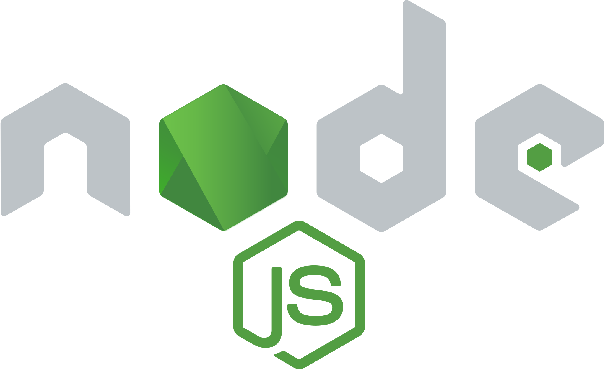
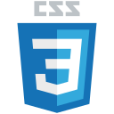
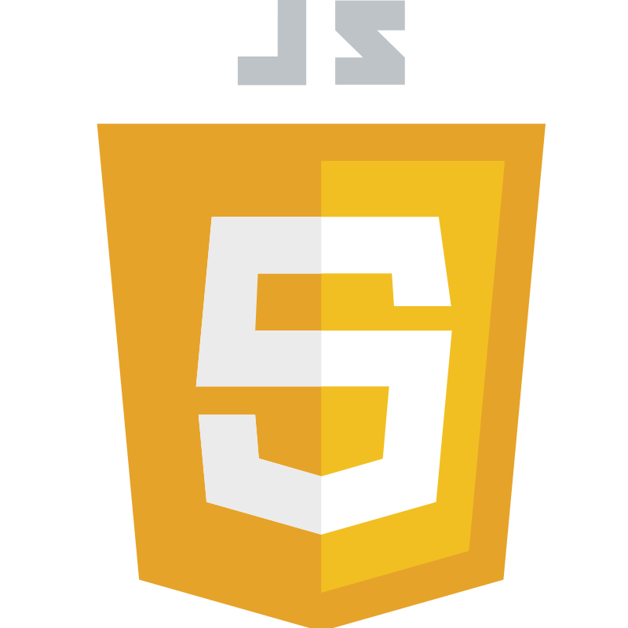

    

<h2 align="center">Hi 👋, I'm Victor Ottati</h2>
<h3 align="center">A passionate full stack website developer</h3>
 

⚙️ All of my projects are available at [https://vmog.net/](https://vmog.net/)  

📫 How to reach me: **victor.ottati@gmail.com**  

💬 Ask me about: **MongoDB, Express, REACT JS, NODE JS, HTML5, CSS3, Saas & Javascript**
 

 

    
    
    
    

 

    
    
    

 

    

